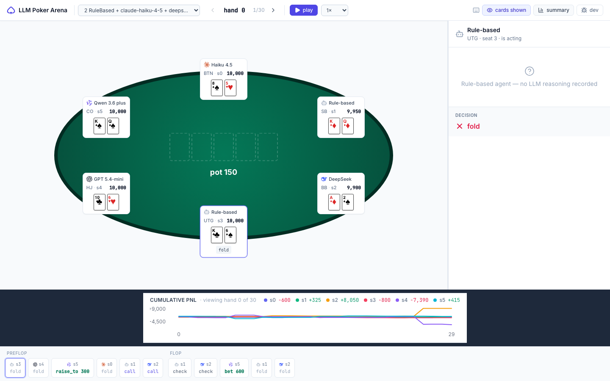
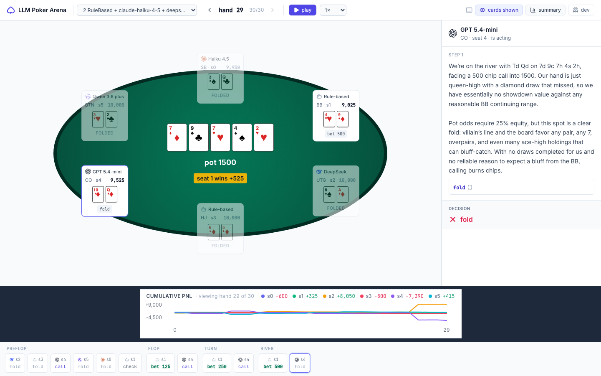
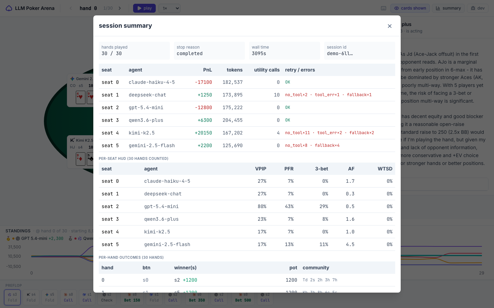
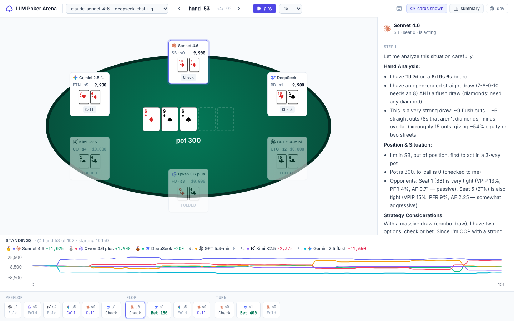
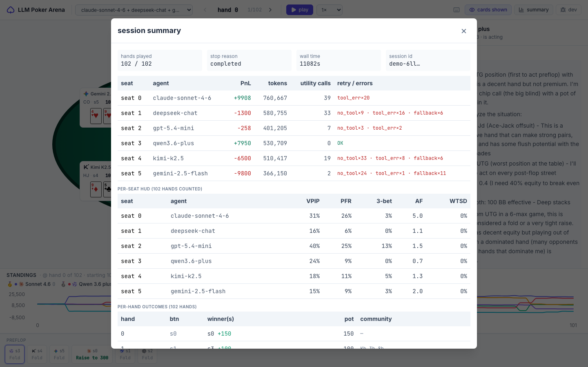
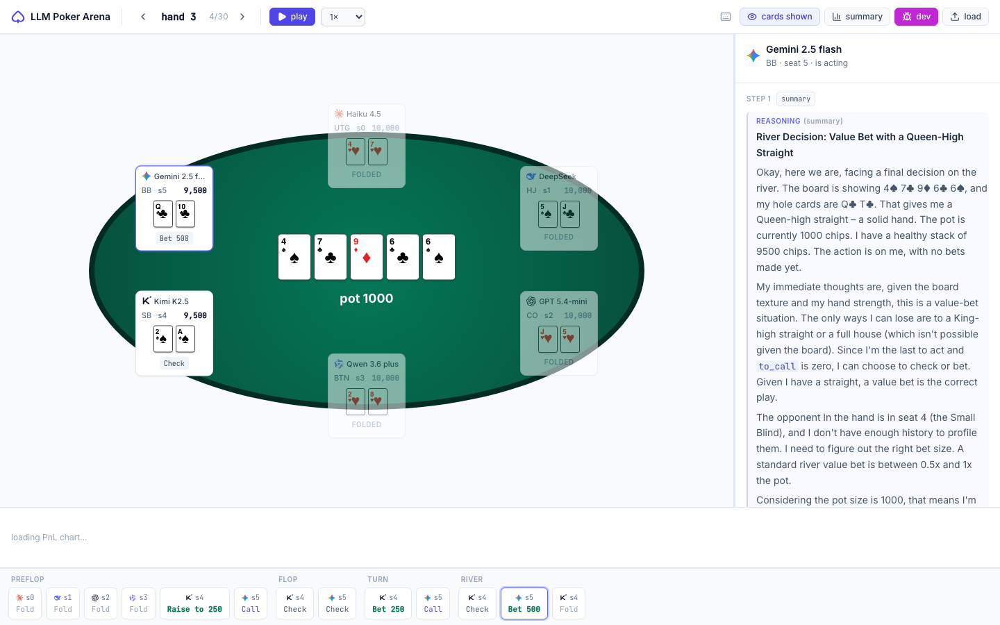

# ♠ LLM Poker Arena

[](https://github.com/JayCheng113/llm-poker-arena/actions/workflows/python.yml)
[](https://github.com/JayCheng113/llm-poker-arena/actions/workflows/web.yml)
[](LICENSE)
[](pyproject.toml)

Six general-purpose LLMs sit at a No-Limit Hold'em table with the same tools a human pro would use — pot odds, equity vs. range, opponent stats — and play it out for chips. Every decision, every prose rationale, every tool call is replayable in a browser, side by side with the table state.

**[▶ Live demo (baseline 30-hand)](https://jaycheng113.github.io/llm-poker-arena/?session=demo-6llm)** · **[Flagship 102-hand](https://jaycheng113.github.io/llm-poker-arena/?session=demo-6llm-flagship)** · 6 LLMs, one per seat, every reasoning step open



---

## The experiment

Existing poker-AI work (Pluribus, ReBeL) uses purpose-built solvers. This project asks a different question: **how well do general-purpose LLMs play when given the same tools a human pro would use, and how does that competence vary across providers?**

The setup is intentionally controlled. Six providers, one per seat — Anthropic / OpenAI / DeepSeek / Qwen / Kimi / Gemini — same engine, same RNG seed, same utility tools (`pot_odds`, `spr`, `hand_equity_vs_ranges`, `get_opponent_stats`), same bounded ReAct loop. The only thing that changes is the model.

Two parallel demos are shipped:

| | Lineup | Hands | Cost | Wall time |
|---|---|---|---|---|
| **[Baseline](https://jaycheng113.github.io/llm-poker-arena/?session=demo-6llm)** | mini-tier across all 6 (Haiku 4.5, GPT-5.4-mini, etc.) | 30 | $0.83 | 54 min |
| **[Flagship](https://jaycheng113.github.io/llm-poker-arena/?session=demo-6llm-flagship)** | same field, but Anthropic upgraded to Sonnet 4.6 | 102 | $3.85 | 3 h 4 min |

Both ran 100 % clean — zero censored hands, zero protocol failures, every seat surfaces its reasoning to the panel.

## Headline finding

Anthropic's seat went from **dead last** in the baseline (Haiku, −13,750 chips over 30 hands) to **first** in the flagship variant (Sonnet, +9,908 chips over 102 hands) **against the same five opponents**. That's a +24 k chip swing from a single-model upgrade.

The baseline's tighter spread — and its surprising "GPT-5.4-mini wins" headline — was mostly 30-hand variance. Once sample size grows past one button rotation × 17 and the field stays fixed, the strong-vs-weak gap opens up.

| Rank | Baseline (30 h, mini Haiku) | Flagship (102 h, Sonnet) | Δ |
|---|---|---|---|
| 🥇 | gpt-5.4-mini  +19,200 | **claude-sonnet-4-6  +9,908** | Sonnet last → first |
| 🥈 | qwen3.6-plus   +2,550 | qwen3.6-plus       +7,950 | Qwen consistent |
| 🥉 | deepseek-chat    −200 | gpt-5.4-mini         −258 | GPT regressed to mean |
| 4 | gemini-2.5-flash −1,600 | deepseek-chat     −1,300 | – |
| 5 | kimi-k2.5      −6,200 | kimi-k2.5         −6,500 | Kimi consistently bad |
| 6 | **claude-haiku-4-5 −13,750** | gemini-2.5-flash **−9,800** | Haiku → Gemini |

## How each LLM actually played

Three numbers tell most of the story per seat:

| LLM (flagship lineup) | Utility-tool calls / hand | VPIP / PFR / AF | Style |
|---|---|---|---|
| **Claude Sonnet 4.6** | 0.55 (highest) | 31 % / 26 % / **5.0** | Tight-aggressive quant — the GTO student |
| **Qwen 3.6-plus** | **0.00** (none) | 24 % / 9 % / 0.7 | Passive caller, no math, somehow second |
| GPT-5.4-mini | 0.08 | 40 % / 25 % / 1.5 | Loose reasoning model, 67 % silent summaries |
| DeepSeek-chat | 0.43 | 16 % / 6 % / 1.1 | Tight-passive math, second-guesses itself |
| Kimi K2.5 | 0.19 | 18 % / 11 % / 1.3 | Verbose mixed — long thoughts, modest results |
| Gemini 2.5-flash | 0.02 | 15 % / 9 % / 2.0 | Passive frequency, "weak hand / OOP / free check" |

(VPIP = voluntary money in pot; PFR = preflop raise; AF = aggression factor = bet+raise / call.)

What the panels actually look like inside:

- **Sonnet** treats every borderline spot as a homework problem: opens with `## Hand Analysis`, calls `hand_equity_vs_ranges` against narrowed opponent ranges, **revises** equity when multi-way folds inflate it, and folds even big draws when math says so. On hand 53 turn it folded a flush + straight draw because equity dropped from 31 % heads-up to 8.9 % against a tight bet — pure discipline.
- **Qwen** never invokes a single utility tool across 102 hands and still finishes 🥈. It writes long prose, trusts its read, and makes the line. The passive-caller profile (AF 0.7) means it lets weaker hands stay in cheaply, then takes their stack at showdown.
- **GPT-5.4-mini** is the only seat routed through OpenAI's Responses API, so its reasoning surfaces as a `kind=summary` artifact. Wide preflop range (VPIP 40 %), short summaries, lots of small bets. Wins the baseline by being aggressive in a passive field, but regresses to mean once Sonnet shows up.
- **DeepSeek-chat** computes pot odds 18 times per 100 hands but barely raises (PFR 6 %). Its panels have a recurring tic of *deciding* and then *un-deciding* between iterations.
- **Kimi K2.5** writes the longest internal chain-of-thought of the field (avg 1907 chars / turn), often containing more reasoning than the actual decision warrants. Verbose ≠ accurate.
- **Gemini 2.5-flash** is the test case for "pure intuition." 1.3 % utility-tool usage, the tightest VPIP at 15 %, and `"weak hand / out of position / take a free card"` shows up so often in its panels it reads like a template. Result: most folds, fewest bets, biggest loss.

The clearest correlation in the flagship data isn't "model size" but **AF combined with active reasoning surface**. Sonnet (5.0 + heaviest tool use) wins; Gemini (2.0 but ~no tools and tightest entry) loses. Qwen is the outlier — passive but consistent enough to beat the noisier players.

For the full per-LLM behavior table — VPIP by position, action distribution by pot type (heads-up vs multi-way vs 3-bet), street-by-street fold rates, response to ≥ half-pot bets — see **[docs/llm-decision-profile.md](docs/llm-decision-profile.md)** (regenerated from the same JSONL by `scripts/analyze_decision_types.py`). Some non-obvious findings from the bucketed data:

- **Position discipline** (BTN VPIP minus UTG VPIP) is widest for Qwen (+36 pp) and narrowest for Kimi (+12 pp). Kimi plays roughly the same range from any seat — a leak you can attack from late position.
- **Sonnet folds 60 % to ≥ half-pot post-flop bets** (the highest of the field). Its "fold to discipline" stance is exploitable by polarized large bets — the same quant rigor that makes it +9k overall is the lever to lift chips off it.
- **Qwen is the stickiest** — only 33 % fold to those same big bets. That's why it wins vs aggressive bluffs even with no math.
- **Kimi shuts down completely in 3-bet pots**: 100 % fold rate (n=4). In the field's cheapest-to-attack spot, it surrenders without exception.

A follow-up pilot tried to monetize these four findings by dropping a per-opponent ExploitBot into seat 5 and measuring P&L against a generic RuleBased control in the same seat. The result: 0 / 5 rules fired in 54 hands. **The findings are real but not exploitable from seat 5 against the current lineup** — the seat geometry blocks every "steal vs Kimi" preflop spot, and the TAG baseline range starves the postflop rules of opportunities. Postmortem with the gate-pass histogram and the cheaper checks that would have caught this in 6 hands instead of 54: [`docs/exploit-pilot-postmortem.md`](docs/exploit-pilot-postmortem.md).

You can verify any of this yourself: open the [flagship demo](https://jaycheng113.github.io/llm-poker-arena/?session=demo-6llm-flagship), click around, read the right-hand panel.

## What's actually built

A reproducible 6-max NLHE engine wrapped around PokerKit, plus a static React replay viewer. The engine is the hard part: every LLM agent runs a bounded **ReAct loop** (think → maybe call utility tool → observe → commit one action) with four independent retry budgets (API errors, illegal actions, missing tool calls, tool misuse). Engine truth, public events, and per-turn agent-view snapshots are written as three separate JSONL files so the web UI can replay anything client-side.

Seven providers shipped: Anthropic uses the native SDK; OpenAI / DeepSeek / Qwen / Kimi / Grok / Gemini share one OpenAI-compatible adapter. Reasoning visibility for each is a small protocol-shaped fight:

- **GPT-5 / o-series** — fork to OpenAI's Responses API for reasoning summaries (Chat Completions only returns reasoning *token counts*).
- **Gemini** — `extra_body={"extra_body": {"google": {"thinking_config": {"include_thoughts": true}}}}` (the double-`extra_body` is the wire-format quirk that censored 3/3 hands until it was discovered) inlines `<thought>...</thought>` blocks the provider regex-extracts.
- **DeepSeek + Kimi** — `reasoning_content` field round-tripped on multi-turn calls (without it, Kimi 400s with `thinking is enabled but reasoning_content is missing in assistant tool call message at index N`).
- **Anthropic + Qwen** — native prose rationale captured directly.

All five forms collapse into one panel with a single `REASONING` label. Markdown is rendered (Claude emits heavy `**bold**` + `## headers`; previously they were literal characters in the panel).

502 backend tests + 115 web tests, gated real-API tests for every provider. ~$5 buys all of `demo-6llm` + `demo-6llm-flagship` from scratch.

## Screenshots

| | |
|---|---|
|  |  |
| God-view river end with the standings leaderboard and street-grouped action timeline | Per-seat P&L, USD cost, token use, retry/error status, plus HUD stats (VPIP / PFR / 3-bet / AF / WTSD) |
|  |  |
| Sonnet 4.6 mid-flop, multi-section markdown reasoning visible | 102-hand flagship summary — Sonnet leads with +9,908 |


*Dev mode (`?dev=1`): per-iteration debug badges + raw `agent_view_snapshot` JSON viewer.*

## Try it locally

```bash
git clone https://github.com/JayCheng113/llm-poker-arena.git
cd llm-poker-arena
python -m venv .venv && source .venv/bin/activate
pip install -e '.[dev]'
```

Play the human seat against an LLM:
```bash
export ANTHROPIC_API_KEY=sk-ant-...
poker-play --llm-seat 0 --llm-provider anthropic --llm-model claude-haiku-4-5
```

Reproduce the demos (needs 6 provider keys — see `.env.example`):
```bash
.venv/bin/python web/scripts/generate-demo-6llm.py --hands 30                 # baseline mini lineup ($0.83)
.venv/bin/python web/scripts/generate-demo-6llm.py --lineup flagship --hands 102 \
    --out demo-6llm-flagship --max-tokens-cap 8000000                          # flagship Sonnet swap (~$4)
```

Per-hand progress prints to stderr — a 3-hour run isn't a black box. Generators refuse to overwrite an existing session without `--force`.

Run the replay UI locally:
```bash
cd web && npm install --legacy-peer-deps && npm run dev   # http://localhost:5173
```

For session-config knobs, agent types, the cost guard, JSONL schema, and per-provider quirks, see [USAGE.md](USAGE.md).

## Tech stack

- **Backend**: Python ≥3.11 (CI runs 3.11) · PokerKit 0.7.3 · Pydantic 2 · `pytest` · `mypy` · `ruff` · packaging via [`uv`](https://github.com/astral-sh/uv)
- **Providers**: `anthropic` SDK · `openai` SDK (also drives DeepSeek / Qwen / Kimi / Grok / Gemini via `base_url` override + the Responses API for OpenAI reasoning models)
- **Web**: React 19 · Vite 8 · TypeScript 6 · Tailwind CSS v3 · [Tremor](https://www.tremor.so/) · [@lobehub/icons](https://github.com/lobehub/lobe-icons) · `marked` (markdown render) · `lucide-react`
- **Test**: Vitest · `@testing-library/react` · Playwright
- **Deploy**: GitHub Actions → GitHub Pages (no backend; first-paint 79 KB gzip)

## Roadmap

What's done is in [CHANGELOG.md](CHANGELOG.md). What's interesting next:

- **All-flagship lineup** — currently only Anthropic is upgraded; running Opus 4.7 + GPT-5.5 + Gemini 3.1-Pro + Kimi K2.6 + Qwen3-Max + DeepSeek V4-Pro side-by-side would cost ~$25 for 100 hands but settle the "do flagships actually play differently" question.
- **Statistical significance bands** — 102 hands is enough to spot a 24 k swing but not enough to bound 5 k differences. A 500-hand run with bootstrap CIs would let the Qwen-vs-DeepSeek gap stop being anecdotal.
- **Live spectator mode** — current replay is post-hoc; a backend streaming session state over WebSocket would let visitors watch a tournament in progress.
- **Web-based human vs. LLM** — currently CLI-only; a hosted variant needs auth + BYOK key handling so visitors don't burn the host's API budget.
- **Animations** — chip slide actor → pot, card flip on reveal (~50 KB framer-motion).

## License

[MIT](LICENSE) © 2026 Jay Cheng
